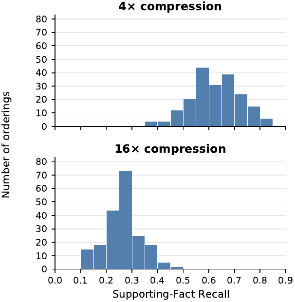
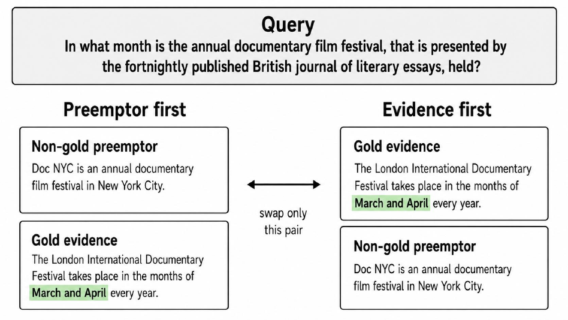

<h1 align="center">MORSE</h1>
<p align="center"><strong>Multi-Context Ordering via Reverse Scoring for Evidence-Preserving Compression</strong></p>
<p align="center"><em>Order evidence first. Search globally. Select what survives.</em></p>

<p align="center">
  <a href="#the-idea">The idea</a> ·
  <a href="#quick-start">Quick start</a> ·
  <a href="#reproducing-the-method">Reproduce the method</a> ·
  <a href="docs/REPRODUCING.md">Documentation</a>
</p>

MORSE is a **compression-aware global context-order search** method for query-conditioned, extractive multi-context compression. When a sequential compressor scores a sentence relative to preceding contexts, partially relevant early passages can preempt the score of stronger evidence arriving later. MORSE addresses this *information preemption* by combining an evidence-first **Reverse** ordering with global permutation exploration, running the **actual compressor under the target token budget** for every candidate, and selecting the compressed result with the highest reverse query-evidence score, $J_B$.

**Paper:** *MORSE: Multi-Context Ordering via Reverse Scoring for Evidence-Preserving Compression*. The public arXiv link and confirmed author metadata will be added when the preprint is available.

## The idea

**Figure 1a · Context-order sensitivity**

<p align="center">
  <a href="assets/figure1_left_stats_2panel.pdf">
    
  </a>
</p>


**Figure 1b · Controlled information-preemption pair swap**

<p align="center">
  <a href="assets/pair_swap_current_figure.pdf">
    
  </a>
</p>


Both previews above are rendered directly from the **original manuscript PDFs**, not newly designed diagrams. The first shows how changing context order affects supporting-fact recall under identical compression; the second illustrates an evidence-first intervention that changes only one context pair.

The default paper configuration uses **K = 5**: one Reverse anchor plus four unique global random permutations. Selection is based on *compressed outputs*, not the scores of the original uncompressed orders. At K=1, MORSE reduces to the Reverse anchor. When fewer than K unique permutations exist, the implementation saturates the available permutation space.

## Results at a glance

The following **paper-reported** supporting-fact recall (SF-R) values use the primary **1P** compressor on the *native* multi-hop QA context sets. They are rounded as in the manuscript's main table; the complete benchmark inputs and per-example outputs are not included in this lightweight method repository.

| Dataset / compression | Reverse | RandomSearch-5 | MORSE-5 |
|:--|--:|--:|--:|
| HotpotQA / 4× | 0.71 | 0.72 | **0.74** |
| HotpotQA / 8× | 0.58 | 0.58 | **0.62** |
| HotpotQA / 16× | 0.41 | 0.41 | **0.44** |
| 2WikiMultiHopQA / 4× | 0.55 | 0.55 | **0.59** |
| 2WikiMultiHopQA / 8× | 0.35 | 0.35 | **0.37** |
| 2WikiMultiHopQA / 16× | 0.21 | 0.23 | **0.24** |

These values describe the specified evaluation populations, not a guarantee for every dataset or retrieval setting; the paper also reports more varied results under larger context collections and for downstream answer quality.

## Method and implementation

| Component | What is included |
|:--|:--|
| [`morse/ordering.py`](morse/ordering.py) | Evidence-first Reverse anchor from standalone query likelihood |
| [`morse/candidates.py`](morse/candidates.py) | Deterministic, unique global permutations with a stream shared by RandomSearch-K |
| [`morse/compression/`](morse/compression/) | One-pass (`1p`) and iterative sentence deletion (`isd`) sequential compressors |
| [`morse/objective.py`](morse/objective.py) | Compression-aware query-evidence objective `J_B` |
| [`morse/engine.py`](morse/engine.py) | Public `MORSE` API, reference execution and candidate-parallel multi-GPU execution |
| [`runtime/`](runtime/) | Persistent per-GPU workers, work-conserving candidate queue and restart-safe checkpoints |
| [`evaluation/`](evaluation/) | Supporting-fact recall and answer-level F1/EM helpers |
| [`tests/`](tests/) | Deterministic CPU structural tests of search, compression, parity and resume behavior |

The scientific model path uses a **pinned Qwen2.5-0.5B-Instruct** checkpoint, BF16 likelihood scoring with batch dimension one and `use_cache=False` for iterative deletion. Fast mode runs independent, otherwise identical candidate trajectories concurrently on explicit GPUs; it does not switch to approximate or batched scientific scoring.

## Quick start

Python **3.10 or 3.11** and a CUDA-capable environment supporting BF16 are recommended for real model inference. The structural tests and synthetic CPU example do not download a model.

```bash
python -m venv .venv
source .venv/bin/activate
python -m pip install -e '.[test]'
python -m pytest -q tests
python examples/cpu_smoke_test.py
```

For a **real model-backed** example, obtain the public checkpoint specified in `configs/models.yaml` and run:

```bash
python scripts/run_morse.py \
  --input examples/example_input.json \
  --compressor 1p --K 5 --seed 42 \
  --mode reference --device cuda:0 \
  --output outputs/example_result.json
```

Equivalent Python API:

```python
from morse import MORSE

with MORSE(compressor="1p", K=5, seed=42, mode="reference", device="cuda:0") as engine:
    result = engine.compress(
        query="Which city is home to the Eiffel Tower?",
        contexts=[
            {"title": "Eiffel Tower", "sentences": ["The Eiffel Tower is in Paris."]},
            {"title": "Berlin", "sentences": ["Berlin is the capital of Germany."]},
        ],
        target_budget=24,  # retained sentence-token budget
    )
print(result.compressed_text)
print(result.selected_order, result.J_B)
```

Loading the checkpoint uses `trust_remote_code=True`; review the third-party checkpoint's code and license before executing it. The initial download requires internet access and model inference requires the substantial model dependencies in `pyproject.toml`.

## Reproducing the method

Run the paper's default five-candidate search with either supported compressor:

```bash
# Sequential one-pass compression
python scripts/run_morse.py --input examples/example_input.json \
  --compressor 1p --K 5 --mode reference --device cuda:0

# Iterative deletion; candidate-level parallelism across independent GPUs
python scripts/run_morse.py --input examples/example_input.json \
  --compressor isd --K 5 --mode fast --gpus 0,1,2,3,4 \
  --checkpoint-dir checkpoints/example

# Compute-matched random-search reference (same deterministic random stream)
python scripts/run_randomsearch.py --input examples/example_input.json \
  --compressor 1p --K 5 --device cuda:0
```

**Reproduction scope:** The released implementation covers the paper's core MORSE/Reverse/RandomSearch-K methods, both compressors, deterministic candidate selection and evaluation metric helpers. It does **not** bundle third-party datasets, checkpoint weights, the fixed paper evaluation-cohort manifests, raw model predictions, or paper-specific latency/reproduction artifacts. Consequently it is a **method release**, not a claim of one-command reproduction of every manuscript table or throughput figure. See [reproduction instructions](docs/REPRODUCING.md), [release scope](docs/RELEASE_SCOPE.md) and the historical [scientific parity report](SCIENTIFIC_PARITY_REPORT.md).

## Determinism and correctness

Candidate streams depend on example identity, namespace and seed. In fast mode, full candidate trajectories run on persistent GPU workers, with provenance-checked atomic checkpointing. The included CPU suite tests structural behavior and deterministic parity. The historical scientific parity report records separate model-backed comparisons performed during release preparation; the included tests do not independently re-run those GPU experiments.

## Citation and license

If MORSE is useful in your research, cite the paper after its public arXiv record is available. A complete BibTeX/CITATION.cff entry will be added after the authors and arXiv identifier are confirmed. The code is provided under the [MIT License](LICENSE). Third-party model checkpoints and datasets retain their own terms.
